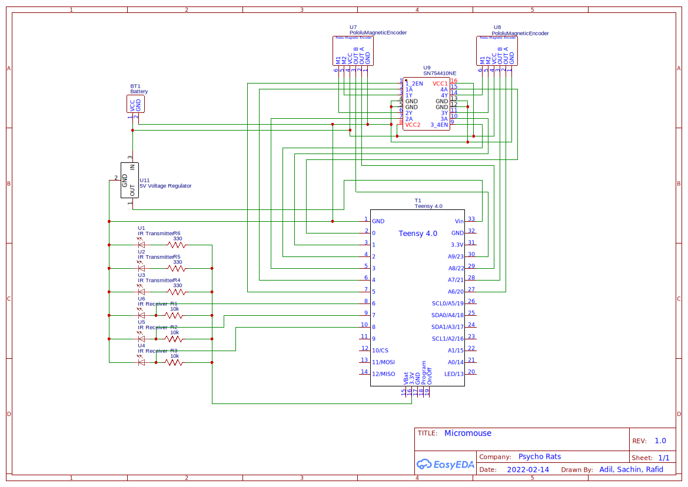

# Micromouse

Competitiong to see which robot solves a 16x16 maze the fastest. Uses infrared lights to "see" walls of the maze.

I will attempt programming it in both Arduino and Rust to learn the pros and cons of each.

## Building with Rust

Relies on [teensy4-rs](https://github.com/mciantyre/teensy4-rs) which has dependencies which need to be installed first.

### Setup

```
rustup target add thumbv7em-none-eabihf
cargo install cargo-binutils
rustup component add llvm-tools-preview
```
[`teensy_loader_cli`](https://github.com/PaulStoffregen/teensy_loader_cli) is needed to download programs to the Teensy.

### Compiling

```
cargo objcopy --release -- -O ihex program.hex
```

### Running

You will need a build of [teensy_loader_cli](https://github.com/PaulStoffregen/teensy_loader_cli) to download programs to a Teensy 4.

## Building with Arduino

### Setup

* Install [Arduino IDE](https://www.arduino.cc/en/software).
* Get [Teensyduino](https://www.pjrc.com/teensy/td_download.html) to add support for Teensy microcontrollers to Arduino IDE.

### Compiling and running

Simply use the buttons.

## Schematic
